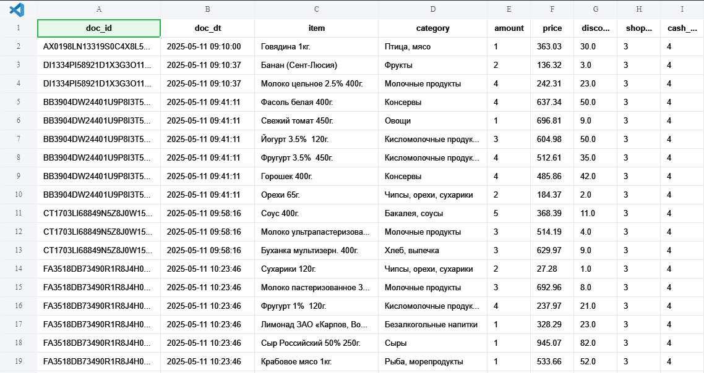
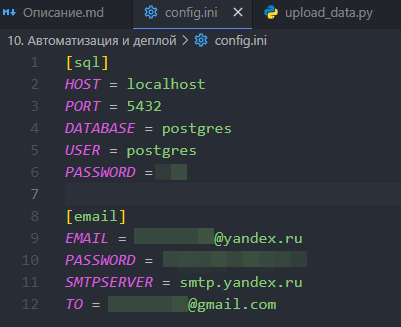
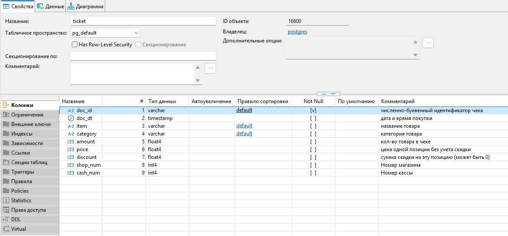

# Автоматизация и деплой. Итоговая работа
Итоговое задание Главы 10 Автоматизация и деплой

## Описание

Само задание можно посмотреть в фале "[Описание.md](Описание.md)"

> Все необходимые библиотеки находятся в файле `requirements.txt`

### Логирование работы
Логирование работы скриптов пишется в файлы `/logs/{today}.log`, где `{today}` - сегодняшняя дата.
```log
2025-05-13 22:00:03,728 INFO: Запуск скрипта generate_data.py для генерации данных чеков...
2025-05-13 22:00:03,828 INFO: Файл "data/1-1.csv" создан.
2025-05-13 22:00:03,929 INFO: Файл "data/1-2.csv" создан.
...
2025-05-13 22:00:08,093 INFO: Скрипт generate_data.py успешно завершён. Файлы с чеками успешно созданы.
2025-05-13 22:30:03,111 INFO: Запуск скрипта upload_data.py для выгрузки данных в БД...
2025-05-13 22:30:03,254 INFO: Обработка файла 1-1.csv
2025-05-13 22:30:03,379 INFO: Файл 1-1.csv обработан
2025-05-13 22:30:03,403 INFO: Обработка файла 1-2.csv
2025-05-13 22:30:03,522 INFO: Файл 1-2.csv обработан
...
2025-05-13 22:30:05,294 INFO: Работа программы завершена
2025-05-13 22:30:07,492 INFO: E-mail успешно отправлен!
```

### Генерация чека

С помощью скрипта `generate_data.py` генерируются чеки в формате `*.csv`, имитируя выгрузку чеков из `N` кассовых аппаратов сети магазинов  в папку `data/`.
   - Файлы с выгрузками называются `{shop_num}_{cash_num}.csv`, где `{shop_num}` - номер магазина, а `{cash_num}` - номер кассы.
   - В одном магазине может быть много касс - у каждой своя выгрузка.
   - Пример названия: `11_2.csv` - 11 магазин, 2 касса.
   - Формат выгрузки:
     - `doc_id` - численно-буквенный идентификатор чека
     - `doc_dt` - дата и время покупки
     - `item` - название товара
     - `category` - категория товара
     - `amount` - кол-во товара в чеке
     - `price` - цена одной позиции без учета скидки
     - `discount` - сумма скидки на эту позицию (может быть 0)
   - Генерация происходит с помощью модулей `random`, `numpy` и `faker`.
     - Если не установлены `requirements.txt`, тогда следует установить их отдельно: `pip install numpy, faker` 

Пример сгенерированного `csv`-файла из директории `data/`:


### Подключение к БД PostgreSQL

Подключение к БД происходит через класс `PGDatabase` в файле `pgdb.py`. Так как нам нужно только заносить данные, то добавлена только одна функция `post`, для занесения данных в БД.

### Выгрузка в БД
Выгружаются файлы `.csv` из директории `data/`. Другие форматы файлов игнорируются.

Выполняется проверка содержимого файла на соответствие формата выгрузки (наличие необходимых столбцов)

Пример занесённого в БД `csv`-файла из директории `data/`:


### Отправка сообщения на электронную почту

По завершении работы отправляется письмо на электронную почту с логом работы программы в качестве вложения.


## Установка и настройка

1. Склонировать репозиторий в любую директорию:
```
git clone https://github.com/mishandri/autodeploy.git
```

2. В файле `config.ini` указать необходимые настройки:
```ini
[sql]
HOST = localhost     ; адрес сервера БД
PORT = 5432          ; порт сервера БД
DATABASE = postgres  ; имя БД
USER = postgres      ; пользователь БД
PASSWORD = #######   ; пароль пользователя БД

[email]
EMAIL = email_from@yandex.ru ; Адрес электронной почты, с которой будет отправляться письмо о завершении работы
PASSWORD = ################  ; Пароль на почту выше
SMTPSERVER = smtp.yandex.ru  ; SMTP-сервер для отправки почты
TO = email_to@yandex.ru      ; Адрес электронной почты, куда будет направлен отчёт о работе
```


3. Создать таблицу `ticket` в БД:
```sql
CREATE TABLE public.ticket (
	doc_id varchar NOT NULL,
	doc_dt timestamp NULL,
	item varchar NULL,
	category varchar NULL,
	amount float4 NULL,
	price float4 NULL,
	discount float4 NULL,
    shop_num int NULL,
    cash_num int NULL
);
```
> SQL-код также лежит в папке `sql/`.


### Дальнейшие инструкции выполняются из директории, где находятся все файлы репозитороия

4.  Рекомендуется создать виртуальное окружение:
```
python -m venv venv
```
И активировать его:

Для bash:
```sh
/venv/Scripts/activate
```

Для PowerShell
```ps1
/venv/Scripts/Activate.ps1
```

Для cmd
```cmd
/venv/Scripts/activate.bat
```

5.  Установить необходимые зависимости из файла `requirements.txt`
```
pip install -r requirements.txt
```

6.  Создать две задачи в Планировщике Windows или же в crontab, указав полные пути. Желательно, чтобы между первой и второй частью программы было достаточно времения для завершения работы перовй части. Например, для Планировщика задач:
```
C:\autodeploy\venv\Scripts\python.exe C:\autodeploy\generate_data.py
```
```
C:\autodeploy\venv\Scripts\python.exe C:\autodeploy\upload_data.py
```

> Примечание 1: Указывайте путь к `python` в соответствии с используемой ОС.
> 
> Примечание 2: Если в пути к файлу `.py` или в пути к директории программы есть пробелы, не забывайте брать весь пусть в двойные кавычки: `"путь"`
